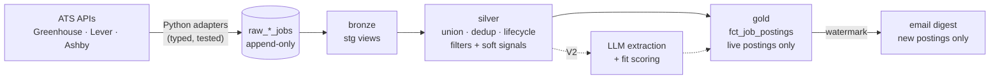

# Job Search Pipeline

End-to-end **Analytics Engineering** project: typed Python ingestion from every ATS with a
public keyless feed (Greenhouse, Lever, Ashby) into a **dual-target dbt project** (DuckDB
dev / BigQuery prod) that dedupes, lifecycle-tracks, and rule-filters postings — then emails
a digest of what's new. LLM relevance scoring (in-warehouse, BigQuery AI) is the scoped V2.



## What a reviewer should notice

- **Medallion = dbt-native.** Three zones map 1:1 onto staging → intermediate → marts
  (ADR-0010), each in its own BigQuery dataset (ADR-0014); raw is append-only with
  partition expiry, and *all* transforms rebuild from it — so filter-rule changes apply
  retroactively with zero migrations.
- **One SQL codebase, two warehouses.** Every model runs on DuckDB (dev/CI, secretless)
  and BigQuery (prod); dialect differences live in `adapter.dispatch` macros — including
  regex-literal escaping and timestamp arithmetic where naive cross-db macros have
  prod-only type traps.
- **Lifecycle, not snapshots.** `first_seen_at` / `last_seen_at` / `is_active` are derived
  from the append-only landing (the source APIs have no date filters), with a staleness
  rule so boards removed from the list age out instead of leaving zombie postings.
- **Rules are data.** Deal-breaker tech, allowed locations, desired tech/titles are dbt
  seeds — word-boundary matched, regex-safe (`C++`, `.NET` work), unit-tested. Hard rules
  drop; soft signals only annotate and order (ADR-0015) — recall stays high until the LLM
  can judge fit.
- **Security is structural.** No secret values in the repo; BigQuery auth via Workload
  Identity Federation (keyless); GH Actions SHA-pinned (`id-token: write` hygiene);
  gitleaks in CI; the company list and candidate profile are private config, never
  committed.
- **Tests gate every commit.** 53 pytest tests (95%+ coverage, enforced), 50 dbt
  schema/unit tests, mypy `--strict`, sqlfluff, plus a CI parse of the prod target — a
  fork-safe pipeline with no secrets in CI.
- **Every non-obvious choice has an ADR** — 20 so far, in `docs/decisions/`.

**Browse the [dbt docs & lineage DAG](https://amikhno.github.io/job-search-pipeline/)** —
generated in CI on every push to main (raw sources → bronze → silver → gold → the email-digest
exposure), or locally via `make dbt-docs`.

## Quickstart

```bash
make install                  # uv venv + pre-commit hooks
cp .env.example .env          # ingestion needs no secrets; fill BQ vars only for prod
cp config/companies.example.csv config/companies.csv   # your PRIVATE company list (gitignored)
# dbt/profiles.yml is committed (env-var driven, no secrets) — nothing to copy

make ingest                   # Python -> raw tables (DuckDB by default)
make dbt-dev                  # bronze -> silver -> gold on DuckDB
make test && make dbt-test
```

## Structure

```
ingest/      per-ATS adapters (Greenhouse, Lever, Ashby), source registry, pipeline entrypoint
shared/      config (Pydantic Settings), models, http, storage (one writer, both warehouses)
deliver/     email digest of new postings (watermark in ops.digest_runs)
config/      private company list (gitignored; .example committed)
dbt/         one dual-target project: models/{bronze,silver,gold}, seeds, macros, unit tests
tests/       pytest suite + sanitized fixtures
docs/        decisions/ (20 ADRs), v2-plan.md, research/  (ARCHITECTURE.md at repo root)
.github/     ci.yml (DuckDB, secretless, fork-safe) + ingest.yml (scheduled, WIF, SHA-pinned)
```

## Stack

Python 3.14 + Pydantic v2 · dbt-core with dbt-duckdb (dev) and dbt-bigquery (prod) ·
GitHub Actions (twice-daily ingest, freshness gate, email digest of new postings).

## Status & roadmap

**V1.6 in production** — twice-daily ingestion to BigQuery, transform, freshness gate,
email digest. **V2 (scoped, ADR-0020):** LLM extraction + 1–5 fit scoring inside BigQuery
(`AI.SCORE` / `AI.GENERATE_INT`), score-*ordered* (never filtered) delivery — plan in
`docs/v2-plan.md`. Full design: `ARCHITECTURE.md`.

## License

Personal project. Not currently licensed for redistribution.
